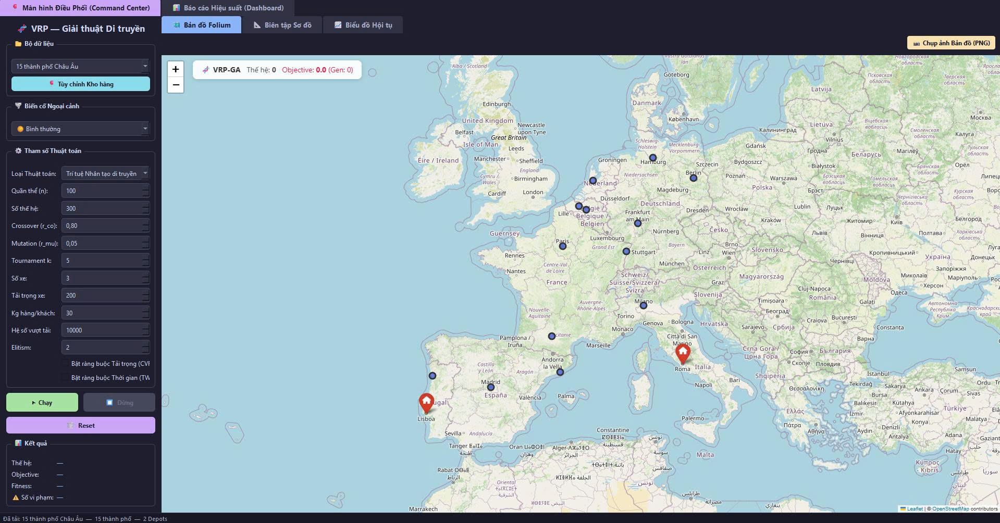
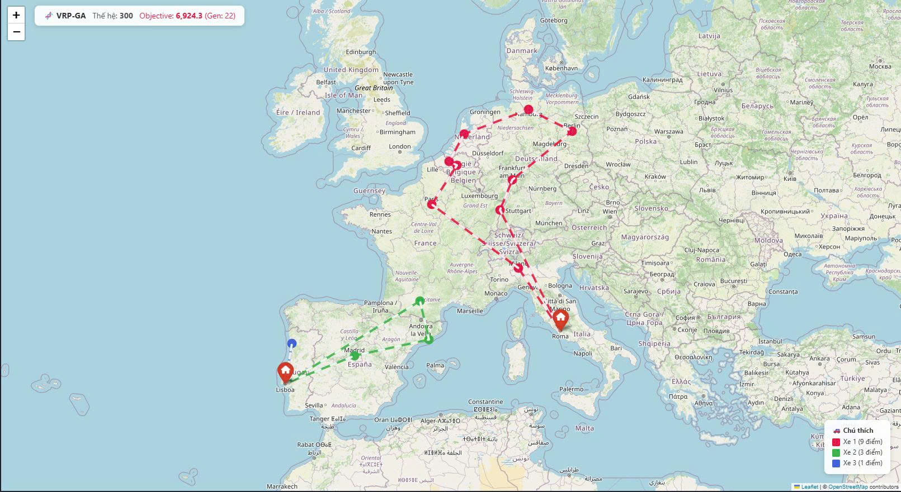
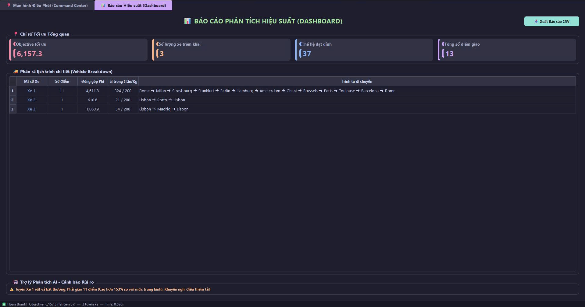
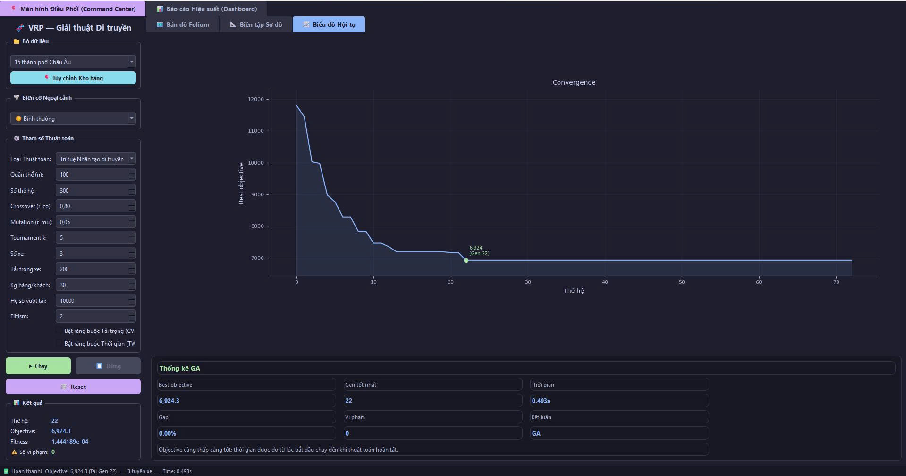

# Giải Bài Toán Tối Ưu Mạng/Luồng Giao Thông Bằng Giải Thuật Di Truyền

[](https://github.com/phuclu3123/GROUP_AI_17_REPORT_FINAL/actions/workflows/ci.yml)
[](https://github.com/phuclu3123/GROUP_AI_17_REPORT_FINAL/actions/workflows/release.yml)

Đây là hệ thống mô phỏng và tối ưu hóa điều phối tuyến xe trên mạng giao thông, triển khai theo hướng bài toán Vehicle Routing Problem và các biến thể mở rộng: VRP, CVRP và VRPTW. Dự án dùng giải thuật di truyền làm thuật toán chính để tìm lịch trình di chuyển có tổng chi phí thấp, đồng thời có thêm Cat Swarm Optimization để so sánh thực nghiệm.

Mục tiêu của repo không chỉ là chạy một thuật toán, mà là xây dựng một ứng dụng desktop có giao diện, dữ liệu, trực quan hóa, dashboard, xuất báo cáo và quy trình đóng gói phần mềm giống một sản phẩm hoàn chỉnh.

## Tải Phần Mềm

Bản Windows mới nhất:

[Download VRP-GA-Solver-Windows.zip](https://github.com/phuclu3123/GROUP_AI_17_REPORT_FINAL/releases/latest/download/VRP-GA-Solver-Windows.zip)

File ZIP chứa `VRP-GA-Solver.exe`. Repo không lưu trực tiếp file `.exe`; GitHub Actions sẽ tự build và đưa file chạy lên GitHub Releases khi tạo version tag.

## Bài Toán Được Giải

Trong thực tế logistics, giao thông đô thị và điều phối vận tải, một đội xe cần xuất phát từ kho, phục vụ nhiều điểm giao hàng/điểm khách hàng, rồi quay về kho. Bài toán cần tối ưu:

- Tổng quãng đường hoặc chi phí di chuyển.
- Số lượng xe sử dụng và cách phân bổ điểm giao cho từng xe.
- Ràng buộc tải trọng của xe.
- Ràng buộc khung thời gian phục vụ.
- Tình huống giao thông thay đổi như mưa bão, kẹt xe hoặc chặn đường.

Dự án mô hình hóa vấn đề này bằng nhóm bài toán VRP:

| Mô hình | Ý nghĩa trong dự án |
| --- | --- |
| VRP | Tối ưu tuyến đi cho nhiều xe từ một hoặc nhiều kho. |
| CVRP | Thêm ràng buộc tải trọng xe và phạt nếu tuyến bị quá tải. |
| VRPTW | Thêm time window, thời gian phục vụ và phạt nếu đến trễ khung giờ. |
| Multi-Depot VRP | Hỗ trợ nhiều depot/kho, mỗi tuyến chọn depot phù hợp theo chi phí vào/ra. |
| Dynamic Traffic Scenario | Mô phỏng tăng chi phí di chuyển hoặc khóa cạnh khi có sự cố giao thông. |

## Điểm Nổi Bật

- Ứng dụng desktop PyQt6, có giao diện điều khiển tham số thuật toán.
- Bản đồ Folium/Leaflet hiển thị depot, khách hàng, tuyến xe và tuyến bị chặn.
- Biểu đồ convergence theo từng thế hệ bằng Matplotlib.
- Dashboard sau khi chạy thuật toán: objective, số xe, thế hệ tốt nhất, số điểm giao, tải trọng từng tuyến.
- Xuất báo cáo CSV và chụp ảnh bản đồ PNG.
- Hỗ trợ import dữ liệu CSV và chỉnh sửa điểm trên bản đồ offline.
- Có chế độ so sánh GA với CSO theo chất lượng nghiệm và thời gian chạy.
- Có CI và release workflow để kiểm tra code, build Windows executable và publish bản tải về.

## Giao Diện Ứng Dụng









## Công Nghệ Sử Dụng

| Nhóm | Công nghệ |
| --- | --- |
| Ngôn ngữ | Python 3 |
| GUI Desktop | PyQt6, QThread, Qt Widgets |
| Web map | PyQt6-WebEngine, Folium, Leaflet.js |
| Tính toán | NumPy, Haversine distance matrix |
| Trực quan hóa | Matplotlib |
| Dữ liệu | CSV, dataset Python built-in |
| Thuật toán | Genetic Algorithm, Discrete Cat Swarm Optimization |
| Báo cáo | CSV export, LaTeX report, minted |
| Đóng gói | PyInstaller |
| DevOps | GitHub Actions CI, GitHub Releases |

## Kiến Trúc Hệ Thống

```text
Input Dataset / CSV / Editor
        |
        v
Coordinate Data + Depot + Demand + Time Window
        |
        v
Cost Matrix Builder
  - Haversine distance
  - NumPy ndarray
  - city_index lookup
        |
        v
Optimization Engine
  - GAEngine
  - CSOEngine
  - QThread background execution
        |
        v
Fitness Evaluation
  - Travel cost
  - Handling fee
  - Capacity penalty
  - Time-window penalty
  - Invalid-edge penalty
        |
        v
GUI Output
  - Folium map
  - Convergence chart
  - Dashboard
  - CSV / PNG export
```

## Thiết Kế Thuật Toán Di Truyền

### Biểu Diễn Nghiệm

Mỗi nghiệm được biểu diễn bằng một chromosome:

- `genes`: hoán vị các điểm khách hàng, không bao gồm depot.
- `breaks`: các điểm ngắt để chia một chromosome thành nhiều tuyến xe.
- Mỗi segment sau khi tách sẽ được gắn depot ở đầu và cuối tuyến.
- Với nhiều depot, tuyến sẽ chọn depot có tổng chi phí `depot -> first_city + last_city -> depot` thấp nhất.

Ví dụ:

```text
genes  = [A, B, C, D, E]
breaks = [2, 4]

Route 1: Depot - A - B - Depot
Route 2: Depot - C - D - Depot
Route 3: Depot - E - Depot
```

### Hàm Mục Tiêu

Thuật toán tối thiểu hóa objective:

```text
total_cost =
    travel_cost
  + handling_cost
  + capacity_penalty
  + time_window_penalty
  + invalid_edge_penalty

fitness = 1 / total_cost + epsilon
```

Trong đó:

- `travel_cost`: tổng chi phí di chuyển từ ma trận khoảng cách.
- `handling_cost`: chi phí xử lý tại các điểm khách hàng.
- `capacity_penalty`: phạt khi tuyến vượt tải trọng xe trong CVRP.
- `time_window_penalty`: phạt khi xe đến trễ khung giờ trong VRPTW.
- `invalid_edge_penalty`: phạt nặng khi tuyến đi qua cạnh bị chặn hoặc không hợp lệ.

### Vòng Lặp GA

Các bước chính trong `GAEngine`:

1. Khởi tạo quần thể bằng hoán vị ngẫu nhiên các khách hàng.
2. Đánh giá fitness toàn bộ quần thể.
3. Giữ lại elite tốt nhất qua `elitism`.
4. Chọn cha mẹ bằng tournament selection.
5. Lai ghép bằng Order Crossover.
6. Đột biến bằng swap/insertion và mutation trên breakpoints.
7. Cập nhật nghiệm tốt nhất, phát tín hiệu về GUI theo từng thế hệ.
8. Dừng khi đạt số thế hệ tối đa hoặc early stopping.

## So Sánh Với CSO

Dự án có thêm Discrete Cat Swarm Optimization để phục vụ phần thực nghiệm:

- Seeking Mode: tạo các bản sao lân cận và tìm kiếm cục bộ.
- Tracing Mode: học theo cá thể tốt nhất bằng cơ chế lai ghép thứ tự.
- A/B Testing: chạy GA và CSO song song, sau đó so sánh objective, thời gian chạy, số vi phạm và gap chất lượng.

Phần này giúp báo cáo không chỉ dừng ở một thuật toán, mà có cơ sở đối chiếu hiệu năng giữa hai metaheuristic.

## Dữ Liệu Và Kịch Bản Demo

Repo có sẵn 3 nhóm dữ liệu:

- 15 thành phố Châu Âu.
- 34 tỉnh/thành Việt Nam.
- Quận/huyện TP. Hồ Chí Minh.

Ngoài dữ liệu built-in, ứng dụng hỗ trợ:

- Import CSV.
- Tùy chỉnh depot/kho hàng.
- Thêm/xóa điểm khách hàng hoặc depot trên bản đồ offline.
- Sinh time window và service time cho thử nghiệm VRPTW.
- Mô phỏng thời tiết xấu bằng cách tăng ngẫu nhiên chi phí di chuyển.
- Mô phỏng tai nạn/kẹt xe bằng cách khóa một số cạnh trong ma trận chi phí.

## Cấu Trúc Repository

```text
.
├── README.md                         Tài liệu giới thiệu chính của repo
├── requirements-dev.txt              Dependency phục vụ build/release
├── resources/                         Ảnh giao diện và hình minh họa
├── packaging/
│   └── VRP-GA-Solver.spec            Cấu hình PyInstaller
├── .github/workflows/
│   ├── ci.yml                        Kiểm tra syntax Python
│   └── release.yml                   Build và publish Windows release
└── VRP_GA_2_APP/
    ├── main.py                       Entry point ứng dụng
    ├── requirements.txt              Runtime dependencies
    ├── data/                         Dataset và CSV loader
    ├── ga_core/                      Genetic Algorithm core
    ├── cso_core/                     Cat Swarm Optimization core
    ├── gui/                          PyQt6 UI, map, chart, dashboard
    ├── utils/                        Constants và export service
    └── Latex/                        Source báo cáo học thuật
```

## Quy Trình Release Chuyên Nghiệp

Repo đã cấu hình release theo quy trình giống một sản phẩm phần mềm:

1. Code được push lên GitHub.
2. GitHub Actions chạy CI để kiểm tra source Python.
3. Khi tạo version tag, workflow release tự build app Windows.
4. File ZIP được đính kèm vào GitHub Releases.
5. Người dùng tải phần mềm bằng link release, không cần clone repo.

## Chất Lượng Và Quy Ước Repo

Repo đã được cấu hình để tách source code khỏi artifact sinh ra trong quá trình chạy:

- Không commit `__pycache__`, `.pyc`, `dist/`, `build/`, `.exe`.
- Không commit file phụ trợ LaTeX như `.aux`, `.log`, `.toc`, `_minted`.
- Không commit file export runtime như `VRP_Report.csv` hoặc `vrp_map.png`.
- Dùng `.gitattributes` để ổn định line endings.
- Dùng GitHub Releases để phát hành phần mềm.

## Định Hướng Mở Rộng

Các hướng phát triển tiếp theo:

- Đọc dữ liệu mạng đường thật từ API hoặc GIS.
- Thêm hard time window thay vì chỉ soft penalty.
- Thêm benchmark nhiều lần chạy để tính trung bình, độ lệch chuẩn và độ ổn định.
- Thêm unit test cho fitness, cost matrix, crossover và mutation.
- Thêm cấu hình seed để tái lập kết quả thực nghiệm.
- Thêm Docker hoặc installer nếu cần triển khai rộng hơn.

## Tóm Tắt Cho Người Chấm Và Người Xem

Dự án này thể hiện một pipeline đầy đủ từ mô hình hóa bài toán tối ưu giao thông, triển khai metaheuristic, trực quan hóa nghiệm, phân tích kết quả, xuất báo cáo đến đóng gói phần mềm. Phần lõi là Genetic Algorithm cho VRP/CVRP/VRPTW, được tối ưu bằng NumPy cost matrix và chạy nền bằng QThread để giao diện vẫn phản hồi trong quá trình tiến hóa nghiệm.
